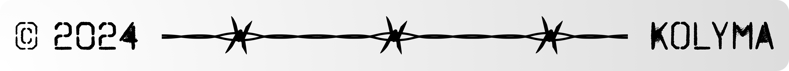

<p align="center">
    
</p>

<p align="center">
    <h3 align="center">NixOS images created with Kolyma's specifications.</h3>
</p>

<p align="center">
    
    <a href="https://github.com/kolyma-labs/installer/releases"></a>
    <a href="https://github.com/kolyma-labs/installer/actions/workflows/test.yml"></a>
</p>

## About

When bootstrapping NixOS on a new server machine, using nixos-anywhere itself becomes a bit of a hassle. This repository aims to provide a simple way to create NixOS images with Kolyma's specifications whereas you may write images to attached usb sticks which will later be booted first upon failed main system boot.

## Features

- Minimal NixOS installation
- Ready ssh & root password

## Download

You can download the latest release from the [releases page](https://github.com/kolyma-labs/installer/releases).

## Burning the image

If you have physical access to your server machine, just use etcher. If you are using a remote server, you can use `dd` to write the image to a usb stick:

```bash
dd if=kolyma-installer-x86_64-linux.iso of=/dev/sdX bs=4M status=progress oflag=sync
```

## License

This project is licensed under the MIT License - see the [LICENSE](license) file for details.

<p align="center">
    
</p>
